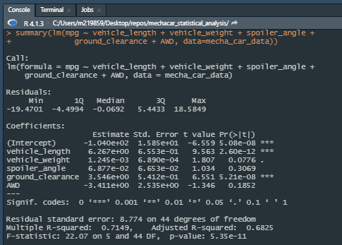
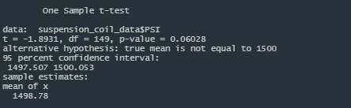
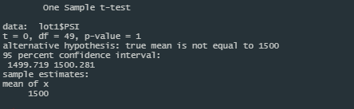
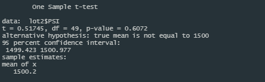
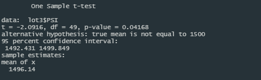

# **MechCar Statistical Analysis**

## **Linear Regression to Predict MPGs**
The linear regresssion leveraging the historical MPG data resulted in the following results for a linear regression:

Vehicle length and Ground clearance were the variables that provided a non-random amount of variance to the MPG values.

Because the p-value of the regression is well below 0.05 at 5.35e-11 we can reject the null hypothesis of the slope being equal to zero.

Due to the Multiple R-Squared value of 0.7149, the model accounts for 71% of the variablity which indicates that the linear model effectively predicts the MPGs of the MechCar prototype.

## **Summary Statistics on Suspension Coils**

When grouping all of the coil data together it is apparent that in aggregate the the design specification is met of having a variance of less than 100 pounds per square inch, as the value is 62.29.

Yet when summarizing the data by the various lots, it is apparent that Lot 3 actually fails this design specification and has a variance of 170.28 pounds per square inch.

## **T-Tests on Suspension Coils**
Based on the results of the test and a p-value not less than 0.05 (was 0.06028) we can not reject the null hypothesis that there was a statistically significant difference in the mean PSI from the standard of 1500 PSI.

When evaluating each lot, Lots 1 and 2 did not have a statistically significant difference in the mean PSI compared to the standard of 1500 PSI. Yet Lot 3 did have a statistically significantly lower mean PSI from the standard.

Lot 1

Lot 2

Lot 3

## **Study Design: MechaCar vs Competition**